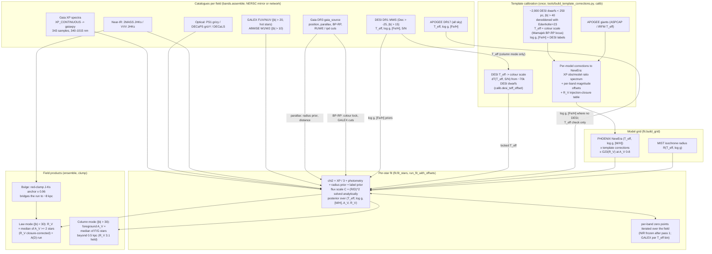

# How the data sets feed a dustline measurement

What each catalogue contributes to the per-star fits, the template calibration and the
field products, and in particular how the DESI DR1 stellar labels are (and are not) used.
State as of 2026-10-02 (branch `local-mirror`). Numbers are the code's defaults; file and
function names point to where each step lives.

## The flow

## The per-star fit

For every Gaia star with an XP spectrum (`fit.fit_stars`):

    F_model(lambda) = C x NewEra_corr(T_eff, log g, [M/H]; lambda) x 10^(-0.4 A_V ext(lambda; R_V))

- `C = (R/D)^2` is solved analytically at every grid point.
- The grid: corrected NewEra templates (T_eff >= 3200 K, all log g; [M/H] 0 alone, or
  -2..+0.5 when the star has a [Fe/H] prior) x A_V 0-8 x R_V 2.3-5.55 (G23).
- chi2 is the sum of four terms:

| term | what | settings (`fit.py`) |
|---|---|---|
| XP | 343 samples, 340-1015 nm (edges masked) | error floors 2 % per sample and 0.5 % of the peak; divided by `XP_SCALE` = 3 (the samples are correlated, ~110 resolution elements) |
| photometry | every assembled band, as flux | systematic floor 0.03 mag (0.04 in Y, 0.15 in GALEX); per-band zero-point offsets iterated over the field |
| radius prior | log R implied by C and the parallax distance vs the MIST radius of the model | parallax zero point -0.017 mas; `plx_inflate` on the errors (x1.7 in crowded bulge fields); off below parallax S/N 3 |
| label prior | Gaussian on (T_eff, log g, [M/H]) from DESI (or APOGEE) | see below |

The fit never uses Gaia's G/BP/RP magnitudes as bands; the XP spectrum carries that information.

## What each catalogue does

| catalogue | where | role |
|---|---|---|
| Gaia DR3 `gaia_source` | everywhere | positions; parallax (radius prior, distances, the A(D) run); RUWE < 1.4 and ipd_frac_multi_peak <= 10 quality cuts; **BP-RP** for the colour T_eff lock and the GALEX colour cuts |
| Gaia XP spectra | everywhere | the core data: the spectral shape constrains T_eff, A_V and R_V jointly |
| PS1 grizy | Dec > -30 outside DECaPS | optical bands; saturation cut |
| DECaPS DR2 grizY | the Galactic plane (DECaPS footprint) | optical bands |
| DECaLS | Dec < -30, \|b\| > 15 | optical bands |
| 2MASS JHKs | everywhere (fallback where VVV is absent) | near-IR bands, the long lever arm for A_V and R_V; zero points frozen after pass 1 |
| VVV JHKs | the VVV window (via `decaps_dr2.stellar_inference`) | near-IR bands in the bulge; the red-clump anchor |
| AllWISE W1/W2 | \|b\| > 10, UV-IR model cache | mid-IR bands |
| GALEX FUV/NUV | \|b\| > 20, UV-IR model cache | UV bands for hot stars only (BP-RP < 1.0 NUV, < 0.6 FUV); 0.15 mag systematic; zero points per T_eff bin (the model UV bias depends on T_eff) |
| DESI DR1 MWS | Dec > -25, \|b\| > 15 | label priors and the column-mode T_eff lock (next section) |
| APOGEE DR17 | all sky | log g / [Fe/H] priors where DESI has none (log g +/- 0.15); fitted T_eff vs ASPCAP reported as a check (`law["apogee_check"]`); the giant template calibrators |

External maps (SFD, Edenhofer+23, the DECaPS 3D map of Zucker+25, the DESI stellar-reddening
map of Zhou+24) are **benchmarks only**, never fit inputs, with one exception: Edenhofer+23
dereddens the template calibrators.

## DESI: what is used, and what is calibrated

### 1. log g and [Fe/H]: priors (log g as published, [Fe/H] turned into [M/H])

`catalogs.desi.shape` turns each DESI DR1 MWS match (RVSpecFit, `rvs_warn = 0`) into a prior:

| label | prior width | recalibrated by dustline? |
|---|---|---|
| log g | DESI error (+) 0.10 dex | no - validated: fit - DESI +/- 0.01, scatter 0.25 dex (`benchmarks/desi_labels`) |
| [Fe/H] -> [M/H] | DESI error (+) 0.10 dex | yes: [M/H] = [Fe/H] + log10(0.638 x 10^[a/Fe] + 0.362) (Salaris+93; [a/Fe] clipped -0.2..+0.5; `catalogs.desi.to_mh`) - raw DESI [Fe/H] reads 0.12-0.16 dex low against the NewEra fits, the alpha-corrected value agrees to +/- 0.02 |

A star with an [Fe/H] prior is fitted on the full [M/H] axis (-2..+0.5); a star without one
is held to -0.5..+0.5 (free [M/H] absorbs residuals).

### 2. T_eff: depends on the mode

| mode | DESI T_eff used? |
|---|---|
| law (\|b\| < 30; all bulge work) | **no**: the label is discarded, T_eff is free (constrained by XP, photometry and the radius prior). The bulge has no DESI stars anyway |
| column (\|b\| > 30), default since 2026-10-01 | **yes, after a correction**: T = T_DESI - dT(T_DESI, S/N), locked (1 K) to the nearest grid node; below DESI S/N 7 only a 250 K prior |
| column, `--colour-lock` (also the fallback with < 30 DESI labels) | no: T_eff locked to the Mamajek-locus T_eff of BP-RP dereddened by the previous pass's A_V - recovers only 0.2-0.3 of the column |

dT (`calib.desi_teff_offset`, `data/desi_teff_scale.json`, `tools/desi_teff_scale.py`) is
DESI's T_eff minus the colour-scale T_eff, measured on ~70k DESI dwarfs/subgiants at
\|b\| > 40 within 1 kpc (BP-RP dereddened with Edenhofer+23): +65..+150 K for 4250-5750 K and
+5..+30 K for 5750-6250 K at S/N > 60, larger at S/N 7-35, erratic below S/N 7. With it, the
column agrees with the DESI reddening map and SFD over 20 fields (`benchmarks/column_zero_point`).

### 3. Calibrating NewEra: DESI calibrates the templates, not the reverse

DESI's labels are **not** calibrated against NewEra. The NewEra templates are instead corrected
empirically (`calib`, `tools/build_template_corrections.py`, release asset
`template_corrections.npz`, tag `tca602f749`):

- **Dwarfs**: ~2,900 DESI dwarfs within 250 pc at \|b\| > 40 with XP, PS1, 2MASS and AllWISE,
  dereddened with the Edenhofer+23 map and fitted at A_V = 0, with
  - T_eff locked to the **colour scale** (the Mamajek BP-RP locus with a [Fe/H] term), not to DESI;
  - log g and [Fe/H] locked to the DESI labels (nearest grid values).
- **Giants**: APOGEE DR17 giants, T_eff from ASPCAP (infrared-flux-method scale).
- Per NewEra model: the median observed/model XP ratio spectrum and per-band magnitude offsets,
  applied multiplicatively to the grid; plus an R_V correction from reddening-injection closure
  (`calib.rv_closure`, used in `ensemble.measure_law`).

So the T_eff anchor of the corrected templates is the empirical colour scale; DESI supplies only
log g and [Fe/H] there. That is why a column-mode fit must shift the DESI T_eff onto the colour
scale (section 2): DESI runs 65-165 K hot against it. DESI's own labels come from fits with
synthetic spectra (RVSpecFit) that are not NewEra, so the offset is measured, not assumed.

## Known limits

- DESI log g / [M/H] were validated on ~5,800 stars in 20 high-latitude fields
  (`benchmarks/desi_labels`); residual [M/H] structure: hot stars (> 5750 K) +0.14..+0.22 dex,
  metal-poor compression (slope 0.72-0.87). Its effect on the column is small (the alpha
  correction moved the 20 columns by a median -0.0007). The template calibrators were labelled
  with raw DESI [Fe/H] (nearly solar, little alpha), not yet rebuilt.
- The column-mode correction is least certain at DESI S/N 7-35: over 20 fields A_V runs from
  -0.015 (G < 14) to +0.014 (G >= 16.5) relative to DESI (a +/- 0.015 systematic).
- The template corrections inherit the colour T_eff scale and the Edenhofer dereddening of the
  calibrators (checked to ~0.01 in A_V: `benchmarks/column_zero_point`).
- High-latitude fields without DESI labels fall back to the colour lock, which under-measures
  the column 3-5x; a converging lock is still to be built.
- In the bulge, the optical law is steeper between V and I than G23 at the R_V that fits I and
  the near-IR (`benchmarks/bensby2017`, Stage A); bands bluer than i under G23 carry that.
