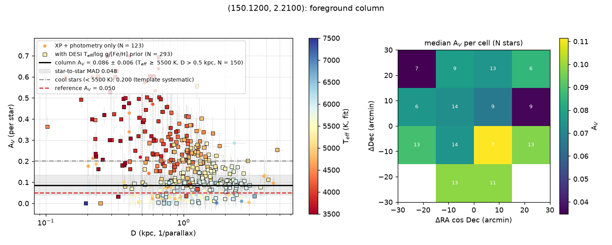
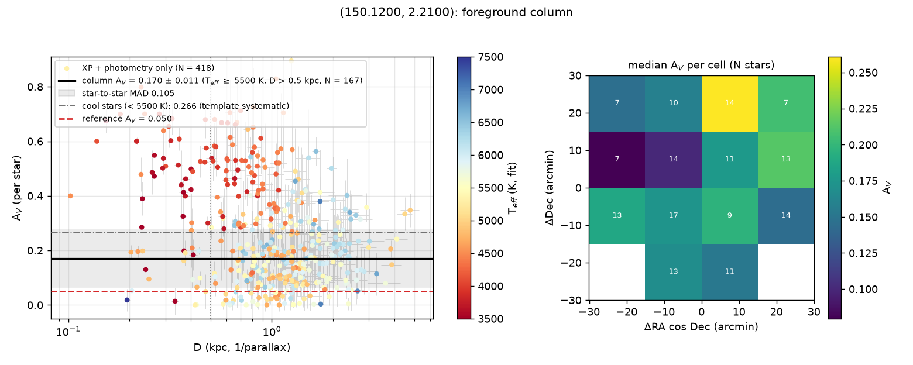

# Example: COSMOS (column mode, DESI priors)

Sightline RA 150.12, Dec +2.21 (l 237°, b +42°), **30′ radius**. High latitude, so
column mode: no measurable R_V (G23 at R_V = 3.1 assumed; the per-star fit holds R_V at
the grid value 3.05), and the product is the total foreground A_V. Photometry PS1 grizy +
2MASS JHKs; 592 Gaia XP stars fitted, **422 of them with DESI DR1 MWS T_eff / log g /
[Fe/H] priors** (Data Lab `desi_dr1.mws`, joined on Gaia `source_id`). Reference:
SFD E(B−V) ≈ 0.018 → A_V ≈ 0.05.

```bash
dustline run 150.12 2.21 --radius 30 --ref-av 0.05 -o extinction_I.csv --plots .
dustline run 150.12 2.21 --radius 30 --no-spectro --ref-av 0.05 --plots nospec/   # A/B
```

(~18 min for the XP fetch, 90 s for the 3-metallicity grid, ~5 min of fits.)

## Result

| sample (plx S/N > 5, D > 0.5 kpc) | N | A_V median | ± (bootstrap) | MAD |
|---|---|---|---|---|
| **F/G stars, T_eff ≥ 5500 K** (the recommended column) | 150 | **0.086** | 0.006 | 0.048 |
| … of which with a DESI prior | 99 | 0.095 | 0.003 | 0.030 |
| K/M stars, T_eff < 5500 K | 207 | 0.200 | 0.007 | 0.136 |
| G < 14 | 38 | 0.039 | 0.009 | |
| 14 ≤ G < 15.5 | 89 | 0.083 | 0.010 | |
| 15.5 ≤ G < 16.5 | 100 | 0.105 | 0.007 | |
| G ≥ 16.5 | 130 | 0.239 | 0.012 | |
| all stars | 357 | 0.118 | | |

**A/B without DESI priors** (`--no-spectro`, solar-metallicity grid, free T_eff): the
F/G column is 0.170 ± 0.011 with MAD 0.105 — twice the value and twice the scatter. Star by
star, the free fit runs 155 K hotter than DESI on the F/G stars and compensates with
+0.08 mag of A_V (correlation of ΔA_V with ΔT_eff: 0.98); the DESI prior breaks that
degeneracy and halves the per-star scatter (0.095 → 0.031). The template scales agree:
median T_eff(DESI) − T_eff(fit) = 25 K, log g −0.03.

**What limits the column.** The K/M dwarfs (mostly G > 15.5) return A_V ≈ 0.2–0.3 against
a 0.05 foreground — a cool-template / faint-XP systematic, not dust — so
`foreground_column` headlines the T_eff ≥ 5500 K stars. Among those, the DESI-anchored
value (0.095) sits ~0.04 above SFD while the brightest stars (G < 14) give 0.039: the
systematics floor of the method at low A_V is **~0.03–0.04 mag**, set by the XP/NewEra
residuals over 336–1020 nm once T_eff is pinned. 87 of the 253 prior stars have
[Fe/H] < −0.5 and sit at the grid edge (`mh_clamped`); extending the NewEra cache to
[M/H] −2 (and to the UV, for GALEX leverage) is the phase-2 lever if this floor matters.

The zero-point offsets converged at |Δ| ≤ 0.016 mag in the optical (2MASS H +0.03), so the
screen / zero-point degeneracy is not what sets the answer here.

## Files

- `extinction_I.csv` — `res.extinction("I")` (A_I/A_V = 0.604 at R_V 3.1)
- `law.json` — `res.law`: the assumed law, `column` (all the numbers above, plus the 4×4
  cell map), `phot_offsets`, `n_spec_prior`
- `column_av.png` — per-star A_V vs D (DESI-prior stars as squares, coloured by T_eff),
  the column and its MAD, the cool-star level, the SFD reference; cell map of the F/G column
- `column_av_nospectro.png` — the same for the `--no-spectro` A/B run
- `extinction_run_I.png` — the A_I(D) running median (flat beyond ~0.5 kpc)




