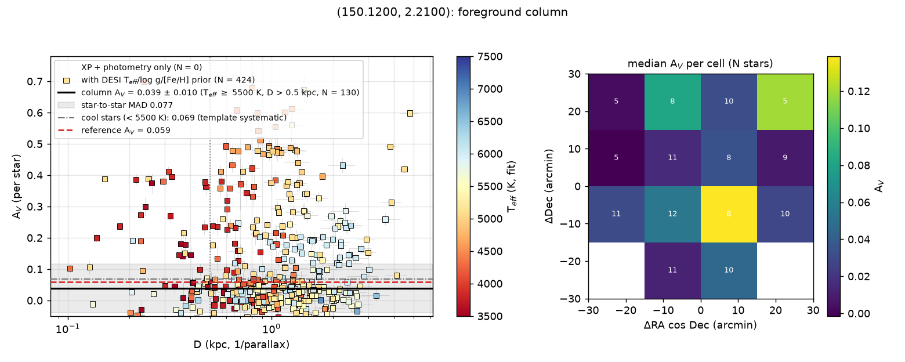

# Example: COSMOS (column mode, T_eff lock, template corrections, GALEX + WISE)

Sightline RA 150.12, Dec +2.21 (l 237°, b +42°), **30′ radius**. High latitude, so
column mode: no measurable R_V (G23 at R_V = 3.1 assumed and held in the per-star fits),
and the product is the total foreground A_V. Photometry PS1 grizy + 2MASS JHKs + AllWISE
W1/W2 (2,281 / 1,793 usable) + GALEX GUVcat_AIS NUV/FUV (294 / 17 usable after the
hot-star colour cuts); 592 Gaia XP stars fitted on the v0.4.0 model cache (900 Å–6 µm,
[M/H] −2..+0.5), **422 of them with DESI DR1 MWS T_eff / log g / [Fe/H] priors**.
Reference: the SFD E(B−V) carried by GUVcat, 0.0186 over the field → A_V = 0.059.

```bash
dustline run 150.12 2.21 --radius 30 --ref-av 0.059 -o extinction_I.csv --plots .
dustline run 150.12 2.21 --radius 30 --no-spectro --ref-av 0.059 --plots nospec/   # A/B
```

(~18 min for the XP fetch, 5 min for the 4,366-model grid, ~10 min of fits.)

## Result (v0.8.0)

| sample (plx S/N > 5, D > 0.5 kpc) | N | A_V median | ± (bootstrap) | MAD |
|---|---|---|---|---|
| **F/G stars, T_eff ≥ 5500 K** (the headline column) | 130 | **0.023** | 0.006 | 0.046 |
| K/M stars, T_eff < 5500 K | 229 | 0.031 | 0.005 | 0.096 |
| … with a GALEX NUV point | 92 | 0.021 | 0.007 | |
| G < 14 | 40 | 0.020 | 0.016 | |
| 14 ≤ G < 15.5 | 89 | 0.029 | 0.007 | |
| 15.5 ≤ G < 16.5 | 100 | 0.021 | 0.008 | |
| G ≥ 16.5 | 130 | 0.037 | 0.014 | |

Every star's T_eff is locked to the empirical Mamajek locus of its dereddened BP−RP (with a
[Fe/H] term; 422 stars carry DESI log g/[Fe/H], 32 more APOGEE, 590 of 592 a locked T_eff),
and the templates carry the label-locked per-model empirical corrections built from 3,474
nearby DESI dwarfs and APOGEE giants (`tca602f749`, `docs/method.md`). Compared with
v0.4.0 (DESI T_eff prior, uncorrected templates: F/G 0.072 ± 0.009 / MAD 0.065, K/M 0.185,
G-trend 0.02 → 0.20): **hot and cool stars now agree to 0.008**, the per-star scatter is
halved, and the magnitude trend is flat to ±0.015 (the faintest bin, G ≥ 16.5, is the only
one above 0.03). Version history of the headline column: 0.072 (v0.4) → 0.027 (v0.5/0.6)
→ 0.029 (v0.7) → 0.023 (v0.8); the control with the T_eff lock but no template corrections
gave 0.039 ± 0.010 (F/G, MAD 0.077) and 0.069 (K/M), so the DESI T_eff label was the larger
part of the old K-dwarf excess and the template colours the rest.

**Zero point.** SFD gives 0.059 (0.05 with the Schlafly & Finkbeiner 2011 rescaling) and
the Edenhofer+2023 3D map 0.057–0.08 at 0.6–1.2 kpc; the measured column is 0.036 below
SFD, 0.027 below the rescaled value. It is **not** a template A_V zero point: the v0.8.0
reddening-injection control at A_V = 0 with the parameters pinned (the column-mode case)
recovers −0.007 for 5500–6500 K dwarfs and +0.017 for K dwarfs, both smaller than the gap
and the F/G sign is wrong to explain it. It is not the screen / zero-point degeneracy
either (the photometric offsets converged at |Δ| ≤ 0.019 mag). What is left is how well the
calibrators (bright, solar-metallicity, 100–250 pc, dereddened with the 3D map at
A_V = 2.8 E) stand in for faint thick-disk stars at 1 kpc, plus the XP/NewEra residual
floor once T_eff is pinned: **±0.03 systematic**, i.e. the difference from SFD is at the
edge of significance and in the direction of the maps reading high at low column.

**External T_eff check.** The 29 stars with APOGEE ASPCAP parameters come back +122 K hot
(MAD 220) against the locked BP−RP scale — a high-latitude field's APOGEE sample is bright
and metal-poor, and 220 K of scatter at A_V ≈ 0.02 is 0.1 mag of potential A_V, so this is
the loosest external constraint in the example set, not a detection of an offset.

## Files

- `extinction_I.csv` — `res.extinction("I")` (A_I/A_V = 0.604 at R_V 3.1)
- `law.json` — `res.law`: the assumed law, `column` (all the numbers above, plus the 4×4
  cell map), `phot_offsets` (incl. the GALEX per-T_eff table), `sfd_ebv`, `model_cache`
- `column_av.png` — per-star A_V vs D (DESI-prior stars as squares, coloured by T_eff),
  the column and its MAD, the cool-star level, the SFD reference; cell map of the F/G column
- `column_av_nocorrections.png` — the control: T_eff lock, no template corrections
  (`DUSTLINE_TEMPLATE_CORR=none`)
- `extinction_run_I.png` — the A_I(D) running median (flat beyond ~0.5 kpc)



