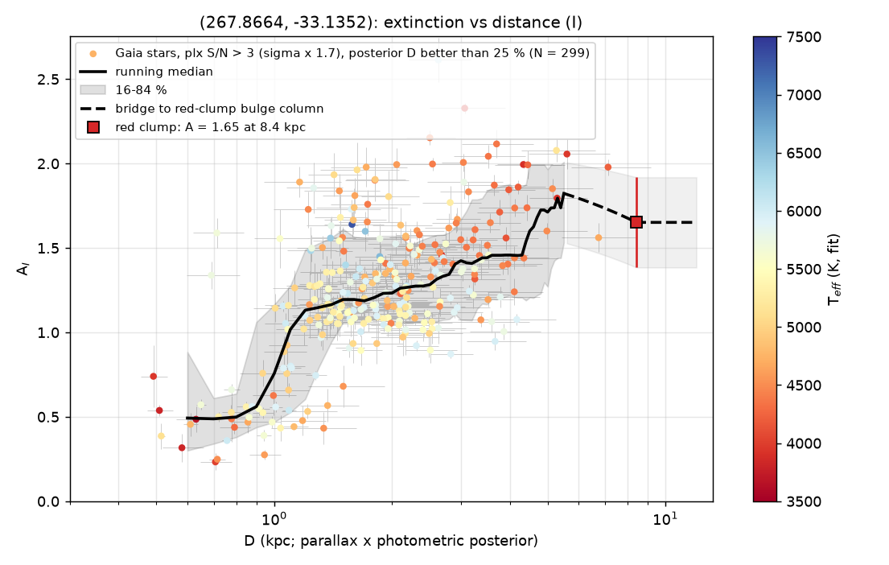
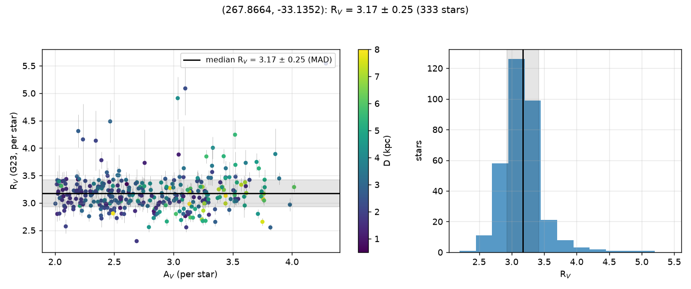

# Example: OGLE-2017-BLG-0095

Sightline RA 267.86642, Dec −33.13517 (l 357.0°, b −3.2°), 5′ radius — the bulge
sightline the method was built for (research prototype 2026-09-17, `~/dustline`).
Photometry: DECaPS DR2 grizY + VVV JHKs (from the DECaPS brutus catalogue; 2MASS fallback).
2,995 stars with XP spectra fitted; the sightline is inside the red-clump bulge window.
The field has 345 Gaia sources per arcmin², where DR3 parallax errors are underestimated
(Luna+2023; El-Badry+2021): the run uses `--plx-inflate 1.7`, calibrated in-field on the
red-clump stars (`law.json["plx_inflation_clump"]`: ×1.65 robust / ×1.88 std from 1,657
clump stars at 8.4 kpc), and per-star distances are the parallax × photometric posterior.

```bash
dustline run 267.86642 -33.13517 --radius 5 --plx-inflate 1.7 --filter I -o extinction_I.csv --plots .
python tools/prior_profile.py 267.86642 -33.13517 --radius 5 --plx-inflate 1.7 -o prior   # declens prior inputs
```

(Numbers are from the v0.8.0 stack: UV–IR model cache, label-locked per-model template
corrections (tag `tca602f749`), sub-grid (R_V, A_V) refinement, closure-corrected law, and
the v0.7.1 parallax treatment. On the v0.7.0 corrections (`tc26438c9b`) the same field gave
R_V 3.16 ± 0.23 from 326 stars [raw 3.07] and a prior median 4.43 kpc — the closure term
shrank from +0.10 to +0.04 and the answer moved by 0.01 in R_V, 0.04 kpc in the prior.
Without the parallax inflation, v0.7.0 gave R_V 3.13 ± 0.25 from 717 stars and 4.35 kpc.
The research prototype (2500–25000 Å cache, solar templates, no corrections, 0.25/0.1 grid,
five-estimator clump column 1.86) gave R_V 3.15 ± 0.23 and 4.41 kpc.)

## Result

- **R_V = 3.17 ± 0.25** (median ± MAD, 333 stars with A_V ≥ 2 and inflated parallax
  S/N > 2; 16–84 % [2.92, 3.45]; 3.14 before the closure correction, +0.04 for a field of
  cool giants at A_V ≈ 2.5 — a third of the v0.7.0 term). Field ratios A_X/A_i: g 1.848,
  r 1.329, z 0.770, Y 0.667, J 0.445, H 0.284, Ks 0.181; for a 6000 K source
  (`prior/xp_law.json`): g 1.877, r 1.333, z 0.769, Y 0.665, Kp 0.186 — within 3 % of
  Schlafly & Finkbeiner (2011).
- **Zero points** (obs − synthetic, converged in 3 passes): DECaPS g −0.062, r −0.089,
  i −0.035, z −0.044, Y −0.055; VVV J −0.016, H +0.005, Ks +0.037 (v0.7.0: g −0.078,
  r −0.092, i −0.033, z −0.041, Y −0.051; prototype: g −0.066, r −0.092, i −0.036,
  z −0.034, Y −0.041; J −0.007, H +0.002, Ks +0.042).
- **Red-clump anchor:** E(J−Ks) = 0.44 from 2,270 clump-window stars at Ks = 13.32,
  giving A_V = 2.71 ± 0.44 (A_Ks = 0.30) at D_RC = 8.4 kpc; A_I 1.65, A_i 1.67 (unchanged
  from v0.7.0 — the anchor is set by the clump colour, not by the templates). The
  prototype's five-estimator column (g−i, i−Ks, J−Ks, H−Ks, LF peaks) was A_i 1.86 ± 0.19
  at 8.3 kpc: the single-colour (J−Ks) anchor is the least leveraged of the five
  (A_i/E(J−Ks) ≈ 3.8, so 0.03 mag of clump colour is 0.1 in A_i).
- **A_I(D)** (A_I/A_V = 0.610 under the measured law; DECam i: ×0.616/0.610):

  | D (kpc) | A_I | 16–84 % | N | |
  |---|---|---|---|---|
  | 1 | 0.76 | 0.47–1.16 | 45 | |
  | 2 | 1.23 | 1.06–1.56 | 118 | |
  | 3 | 1.42 | 1.07–1.67 | 70 | |
  | 4 | 1.46 | 1.22–1.88 | 43 | |
  | 5 | 1.71 | 1.27–1.97 | 21 | |
  | ≥ 8 | 1.68 | 1.41–1.93 | 0 | bridged to the clump column |

  (v0.7.0: 0.67 / 1.23 / 1.32 / 1.40 / 1.55 — the run rose by ≤ 0.15 at 3–5 kpc, within
  the 16–84 % band; prototype, DECam i, 2026-09-18: 1.19 / 1.30 / 1.34 / 1.68 at 1–1.5 /
  1.5–2 / 2–3 / 3–5 kpc; DECaPS brutus, SF11 scale: 1.20 / 1.28 / 1.30 / 1.61.)
- **Source-distance prior** (declens `sed_distance_prior.py`, IMF-weighted MIST grid,
  the measured law and this run in DECam i): `P_SEDdust_XP` **median 4.39 kpc, 68 %
  [3.41, 6.33], 95 % [2.89, 8.23], P(D ≥ 6) 0.21** (equal EEP weights 5.57 [3.99, 7.43];
  v0.7.0 corrections 4.43 [3.35, 6.31]; without the parallax inflation 4.35 [3.40, 6.07];
  the prototype's 4.41 [3.38, 5.90]).
- No APOGEE star with S/N > 30 inside 5′ (the prototype's T_eff check used 15′: +49 K).

## Files

- `extinction_I.csv` — `res.extinction("I")`: `D_kpc, A_med, A_16, A_84, n_stars, bridged, band, ratio_av`
- `law.json` — `res.law`: R_V statistics, per-band A_X/A_V ratios, zero points, the clump
  anchor, the in-field parallax-error calibration
- `prior/xp_dust_run.csv`, `prior/xp_law.json` — the declens prior inputs (DECam i profile;
  source band ratios) from `tools/prior_profile.py`
- `law_rv.png`, `extinction_run_I.png` — figures




