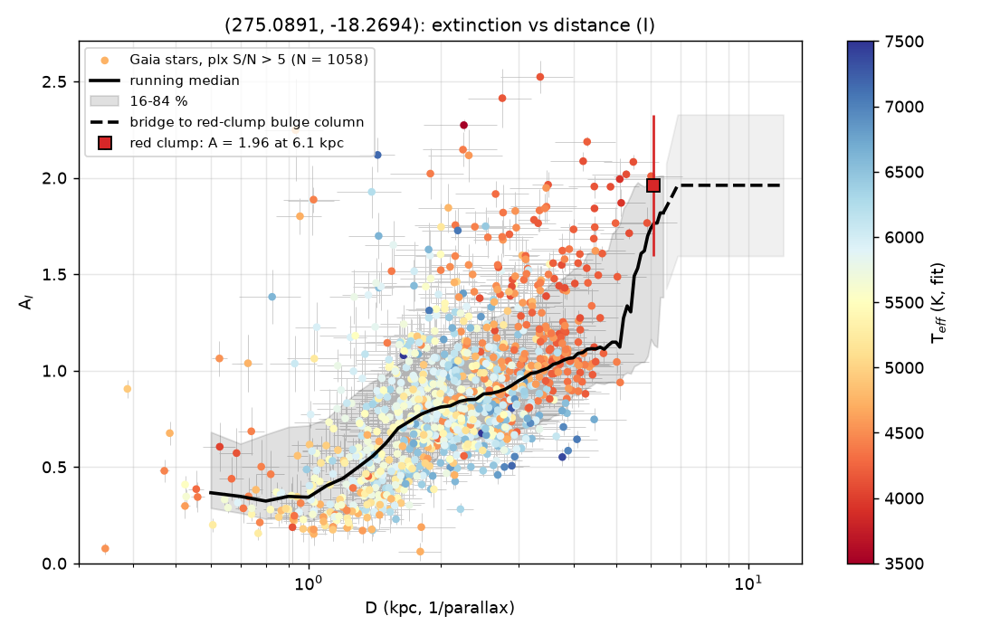
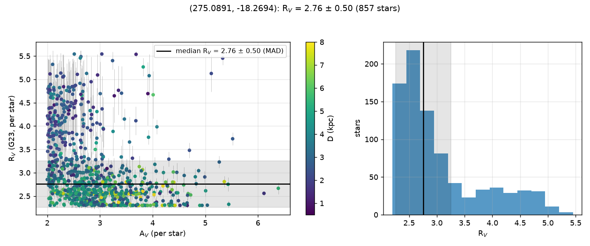

# Example: OGLE-2024-BLG-0669

Sightline RA 275.089125, Dec −18.269389 (l 13.2°, b −1.6°), 9′ radius. Photometry:
PS1 grizy + 2MASS JHKs (no DECaPS/VVV coverage at l > 10°). 4,332 stars with XP spectra
fitted; the sightline is inside the red-clump bulge window.

```bash
dustline run 275.089125 -18.269389 --radius 9 --filter I -o extinction_I.csv --plots .
```

(This directory is regenerated by `tools/run_ob240669.py`, which seeds the Gaia/XP
stage from a local cache instead of the ~2 h archive fetch. Numbers are from the v0.6.0
stack: the 900 Å–6 µm model cache with the empirical dwarf *and giant* template
corrections and the tile-based, saturation-cut PS1 fetch; v0.5.0 (dwarf corrections
only) gave R_V = 2.80 ± 0.46 (895 stars), v0.4.0 2.84 ± 0.48 (946), and the v0.2–0.3 run
on the 2500–25000 Å cache 2.88 ± 0.53 (986); clump column 3.27–3.41.)

## Result

- **R_V = 2.76 ± 0.50** (median ± MAD, 857 stars with A_V ≥ 2).
- **Red-clump anchor:** E(J−Ks) = 0.52 from 1,820 clump-window stars at Ks = 12.65,
  giving A_V = 3.41 ± 0.64 (A_Ks = 0.33) at D_RC = 6.1 kpc.
- **A_I(D)** (A_I/A_V = 0.575 under the measured law):

  | D (kpc) | A_I | 16–84 % | N | |
  |---|---|---|---|---|
  | 1 | 0.34 | | 98 | |
  | 2 | 0.81 | | 441 | |
  | 3 | 0.95 | | 385 | |
  | 4 | 1.07 | | 196 | |
  | 5 | 1.15 | | 83 | |
  | ≥ 7 | 1.96 | | 0 | bridged to the clump column |

## Files

- `extinction_I.csv` — `res.extinction("I")`: `D_kpc, A_med, A_16, A_84, n_stars, bridged, band, ratio_av`
- `law.json` — `res.law`: R_V statistics, per-band A_X/A_V ratios, the clump anchor
- `law_rv.png` — per-star R_V vs A_V (coloured by distance) and the R_V histogram
- `extinction_run_I.png` — per-star A_I vs D (coloured by fitted T_eff), running median
  with 16–84 % band, dashed bridge to the red-clump column




