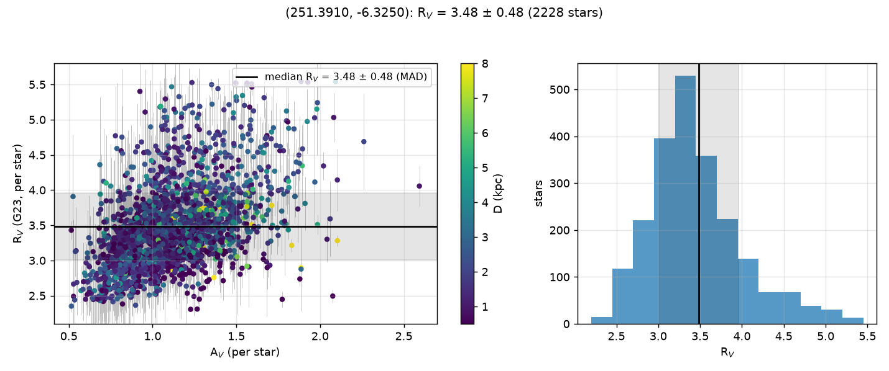
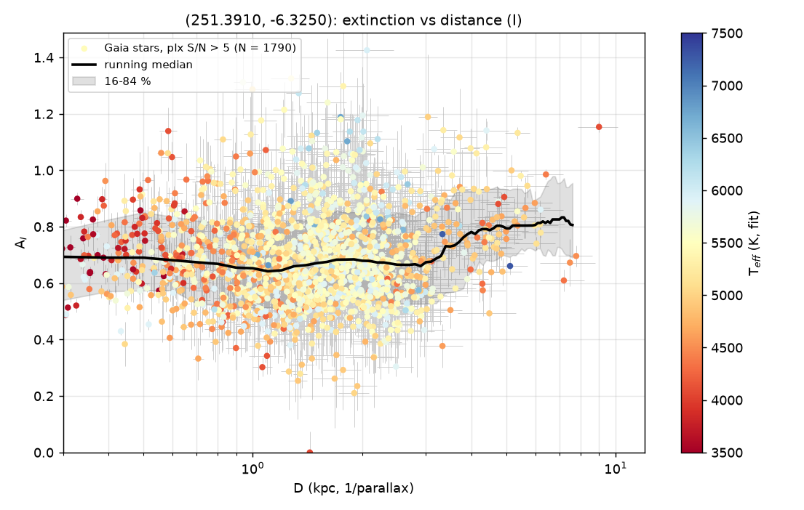

# Example: ZTF19abqmpti (mid-latitude SN Ia sightline, A_V ≈ 1, measured R_V)

Sightline of the ZTF DR2 SN Ia ZTF19abqmpti (z = 0.076): RA 251.391, Dec −6.325
(l 11.4°, b +24.3°), **30′ radius**. Law mode with R_V free on the v0.7.0 stack (UV–IR
cache, rebuilt dwarf + giant template corrections, sub-grid refinement, closure-corrected
law): 18,974 Gaia sources, 2,629 XP stars fitted;
DESI DR1 log g/[Fe/H] priors for 404 stars (no APOGEE, 15 usable GALEX NUV — too
reddened for the UV). Reference foreground: SFD E(B−V) = 0.403 → A_V 1.25 (1.07 with the
S&F11 rescaling); Edenhofer+2023 3D map 0.88 to 1.25 kpc.

```bash
dustline run 251.391 -6.325 --radius 30 --min-av 0.5 -o extinction_I.csv --plots .
```

## Result

- **R_V = 3.48 ± 0.48** (median ± star-to-star MAD, **2,228 stars** with A_V ≥ 0.5; per-star
  errors 0.16–0.54, ~±0.02 statistical on the median). Uncorrected median 3.37 (dwarfs
  3.35, N 2,033; giants 3.47, N 195); the closure correction adds +0.25 to the quarter of
  the sample on cool templates and +0.07 to the rest. No pile-up at the R_V grid edges.
- **Column**: A_V = 1.07 ± 0.25 (MAD) beyond 1 kpc, matching the rescaled SFD (1.07);
  A_I(D) = 0.69 at 0.5 kpc, 0.67 at 1.5–2.5 kpc, rising to 0.82 by 6.5 kpc.
- v0.6.0 (grid without the band corrections at A_V > 0, unrefined estimator, no closure):
  3.44 ± 0.49 from 2,186 stars, column 1.03.

## The R_V–A_V trend (a fit systematic, not dust)

*(v0.6.0 numbers; the trend is unchanged on the v0.7.0 stack — raw R_V 2.93 / 3.26 /
3.40 / 3.73 for A_V 0.5–0.8 / 0.8–1.0 / 1.0–1.3 / > 1.3. The reddening-injection test of
v0.7.0 reproduces it on the calibrators and identifies it as the fit's T_eff–A_V–R_V
error ellipse, symmetric about the truth; the cool-star deficit is the template residual
the closure table now corrects. See `docs/method.md`.)*

| by A_V bin (all D) | R_V | at fixed D 1–2 kpc | by T_eff (A_V 0.8–1.3) | R_V |
|---|---|---|---|---|
| 0.5–0.8 (N 348) | 3.11 | 3.08 | 3500–4500 K (N 124) | 2.79 |
| 0.8–1.1 (N 862) | 3.39 | 3.40 | 4500–5000 K (N 298) | 3.40 |
| 1.1–1.5 (N 838) | 3.55 | 3.62 | 5000–5500 K (N 454) | 3.46 |
| > 1.5 (N 138) | 3.84 | 4.10 | 5500–6500 K (N 517) | 3.54 |

At fixed A_V there is no trend with distance (3.38 / 3.48 / 3.52 / 3.47 at 0.5–1 / 1–2 /
2–4 / 4–10 kpc), while at fixed distance the trend with A_V is intact and the fitted
T_eff rises along it — so it is the T_eff–A_V–R_V coupling of the per-star fit, strongest
for the cool stars whose template corrections rest on the sparsest calibrator nodes. The
5000–6500 K stars, where the calibration is densest, give 3.46–3.54. With the coupling
measured on the calibrators (v0.7.0) the quote is **R_V = 3.5 ± 0.02 (stat) ± 0.1 (sys)**
(closure ±0.05, NIR zero points ±0.05). Compare the bulge (2.80 ± 0.54 at A_V 2–5) and
ZTF20abgaovd (see its example) 5° away on the same side of the inner Galaxy.

## Files

`extinction_I.csv`, `law.json`, `law_rv.png`, `extinction_run_I.png`.




