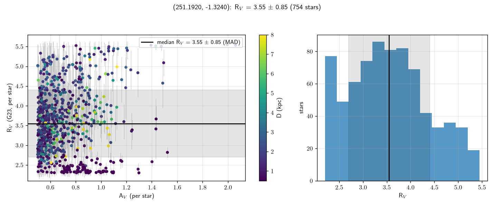
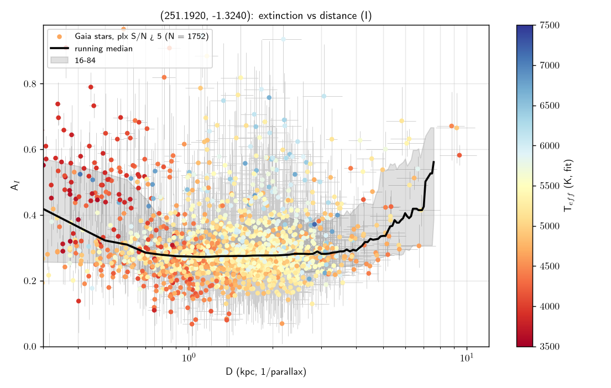

# Example: ZTF20abgaovd (mid-latitude SN Ia sightline, measured R_V)

Sightline of the ZTF DR2 SN Ia ZTF20abgaovd (z = 0.075): RA 251.192, Dec −1.324
(l 15.9°, b +27.2°), **30′ radius**. Law mode with R_V free: 16,558 Gaia sources, 2,629
XP stars fitted on the v0.5 stack (UV–IR cache + corrected dwarf templates); DESI DR1
log g/[Fe/H] priors for 242 stars, APOGEE DR17 for 49 (external T_eff check); PS1 +
2MASS + AllWISE + GALEX NUV (158). Reference foreground: SFD E(B−V) = 0.178 → A_V 0.55
(0.47 with the S&F11 rescaling); Edenhofer+2023 3D map 0.55 to 1.25 kpc.

```bash
dustline run 251.192 -1.324 --radius 30 --min-av 0.5 -o extinction_I.csv --plots .
```

## Result

- **R_V = 3.55 ± 0.85** (median ± star-to-star MAD, 754 stars with A_V ≥ 0.5; per-star
  errors 0.4–0.6, so ~±0.04 statistical on the median). By A_V bin: 3.50 (0.5–0.7,
  N 443), 3.56 (0.7–1.0, N 242), 3.70 (1–2, N 68). Unchanged by the v0.6.0 giant
  corrections (the law sample is dwarf-dominated). The per-star distribution piles up at
  both grid edges (2.3 and 5.5): many stars at A_V ≈ 0.6 are individually unconstrained.
- **Column**: A_V = 0.44 ± 0.11 (MAD) beyond 1 kpc; A_I(D) = 0.33 at 0.5 kpc, flat at 0.28
  from 1 to 4 kpc (the dust is within ~500 pc, z ≈ 230 pc), rising to 0.45–0.53 at
  6–7.5 kpc where the stars are giants (see below).
- **APOGEE check** (45 stars): T_eff(fit) − T_eff(ASPCAP) = −108 K overall (MAD 140), but
  split by class it is **−22 K for the 25 dwarfs** and −119 K for the 20 giants; log g
  +0.06; [Fe/H](DESI) − [Fe/H](APOGEE) = 0.00. Locking the giants to ASPCAP moves their
  A_V 0.50 → 0.68 and R_V 3.0 → 3.2.

## Systematics (this is a first look)

- The DESI T_eff label is not used as a prior (it varies by ±200 K against the colour
  scale with S/N); T_eff comes from XP + photometry + the parallax radius prior, with
  DESI/APOGEE log g and [Fe/H]. A ~65–110 K scale tension with APOGEE remains, worth
  ~0.05–0.1 in A_V and ~0.1–0.2 in R_V.
- Since v0.6.0 the template corrections cover giants too (calibrated on 1,482 nearby
  APOGEE giants with T_eff locked to ASPCAP; closure 0.00 ± 0.01 in the red-clump
  range). But a *free* giant fit in a reddened field still lands ~120 K cooler than
  ASPCAP: giants have no parallax–luminosity lever against the T_eff–A_V degeneracy, so
  the far giants (D > 4 kpc, where A(D) still rises) need an external T_eff (APOGEE here
  covers 20). The dwarfs, which carry the law and the column, are on the APOGEE scale.
- The mean R_V of the G23 family over 0.5–1 mag of extinction is what is measured;
  a systematic of ±0.2 is a fair estimate at this stage.

## Files

`extinction_I.csv`, `law.json` (law, ratios, `apogee_check`, offsets), `law_rv.png`,
`extinction_run_I.png`.




